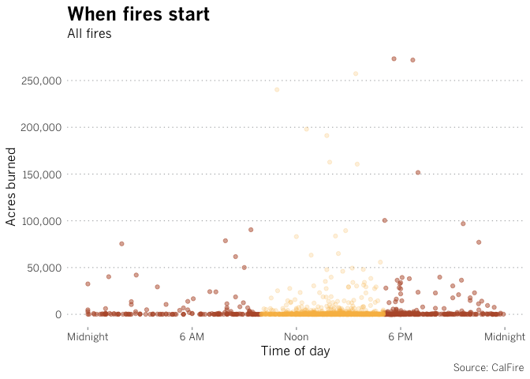
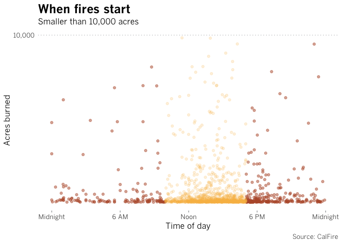
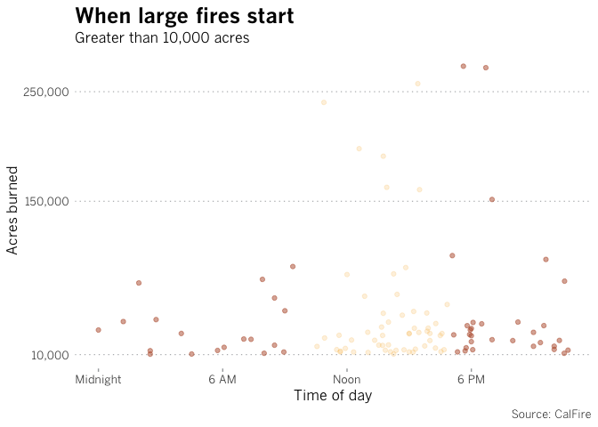
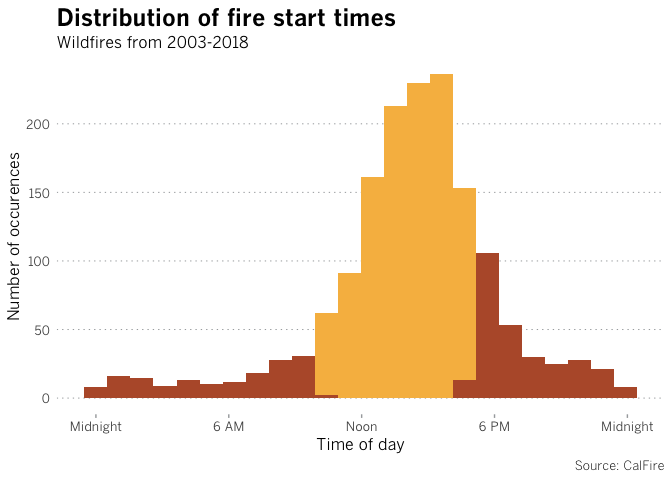

This is an analysis and visualization of when wildfires in California have started to assist the reporting of \[Firefighting aircraft ‘increasingly ineffective’ amid worsening wildfires\]<https://www.latimes.com/local/california/la-me-aircraft-increasingly-ineffective-against-california-wildfires-20190407-story.html>), which looks at the efficacy and effectiveness of fire aircraft deployment.

The analysis uses data scraped from [CAL FIRE's incidents database](http://cdfdata.fire.ca.gov/incidents/incidents_archived?archive_year=2018), which provides fire incident information for fires within and outside the agency's jurisdictions back to 2003. [Go here](http://cdfdata.fire.ca.gov/incidents/incidents_disclaimer) if you'd like to read more information about the data.

Setup
-----

``` r
# Run install.packages('packagename') if required
library(tidyverse)
library(here)
library(magrittr)
library(ggplot2)
library(extrafont)
library(forcats)
library(lubridate)
library(scales)

# Double check it is correctly setting your wd
#here::here()

# Call in data
master_data_raw <- read_csv(here::here("input/wildfires.csv"))
```

Data cleaning
-------------

``` r
# Using temp alt while I figure out how to clean non english characters in data
master_data_cleaning <- read_csv("input/wildfires_alt.csv")

# Take only columns we need
temp_cols_subset <- select(master_data_cleaning, name, acres_burned, date_only, time_24hh)

# Double check column types
#lapply(temp_cols_subset , class) 

# Convert date column so it actually reads as dates
temp_cols_subset$date_only <-  as.Date(temp_cols_subset$date_only, "%m/%d/%y")

# Create a temporary dataframe that do not have missing data for the acres burned column
temp_no_nas <- temp_cols_subset[complete.cases(temp_cols_subset $acres_burned), ]

# Check that it removed correctly // observation number and last index number  in global environment should match
na_check <- na.omit(temp_no_nas$acres_burned) 

# There's a few rows with dirty dates (1969) that should be removed
temp_clean_1969 <- temp_no_nas[format(temp_no_nas$date_only,'%Y') != "1969", ]

# Create new variable for cleaned df
master_data_cleaned <- temp_clean_1969 

# Add new column in df with years only
master_data_cleaned$year_only <- 
substring(master_data_cleaned$date_only,1,4)
```

Analysis
--------

According to [CAL FIRE's general flight rules and operations handbook](http://calfireweb.fire.ca.gov/library/handbooks/8300/8362.pdf), an aircraft's window of operation is during "daylight hours" (pg. 11) and a pilot of a single-pilot aircraft is limited to seven hours of flight time in a 24-hour period (pg. 10).

The reporter said according to CALFIRE, the general hours of operation we could set for visualization purposes can be between 10 AM and 5PM throughout the year. We used those hours for the analysis.

``` r
# Base summary of data
summary(master_data_cleaned)
```

    ##      name            acres_burned      date_only         
    ##  Length:1577        Min.   :     1   Min.   :2003-07-20  
    ##  Class :character   1st Qu.:    42   1st Qu.:2011-08-28  
    ##  Mode  :character   Median :   125   Median :2015-06-10  
    ##                     Mean   :  3750   Mean   :2014-04-22  
    ##                     3rd Qu.:   643   3rd Qu.:2017-07-26  
    ##                     Max.   :273246   Max.   :2018-11-16  
    ##   time_24hh         year_only        
    ##  Length:1577       Length:1577       
    ##  Class1:hms        Class :character  
    ##  Class2:difftime   Mode  :character  
    ##  Mode  :numeric                      
    ##                                      
    ## 

``` r
# How many fires occurred during hours of operation?
fires_during_hours <- master_data_cleaned %>%
filter(hms(time_24hh) >= hms("10:00:00") & hms(time_24hh) <= hms("17:00:00"))

# How many fires occurred outside hours of operation?
fires_outside_hours <- master_data_cleaned %>%
filter(hms(time_24hh) < hms("10:00:00") | hms(time_24hh) > hms("17:00:00"))

# Let's filter for fires based on size of acres
# At least 10,000 acres
large_fires <- master_data_cleaned %>%
  filter(master_data_cleaned$acres_burned >= 10000)

# Smaller than 10,000 acres
smaller_fires <- master_data_cleaned %>%
  filter(master_data_cleaned$acres_burned < 10000)
```

Out of the 1982 CALFIRE incidents scraped, **1,577** were fire incidents that provided at least burn acreage and start time.

**1,131** (71.7%) of those wildfires had a reported start time that fell within the 10AM to 5PM window of operation. **466** (28.3%) did not.

``` r
ggplot(data = master_data_cleaned, aes(x = time_24hh, y = acres_burned)) +
geom_point(
  data = fires_outside_hours, aes(x = time_24hh, y = acres_burned),
  shape = 21,
  stroke = .5,
  fill = "#b75a36",
  color = "#b75a36",
  alpha = 0.5
) +
geom_point(
  data = fires_during_hours, aes(x = time_24hh, y = acres_burned),
  shape = 21,
  stroke = .5,
  fill = "#f7bb4f",
  color = "#f7bb4f",
  alpha = 0.2
)+
# Highlight hours of operation
#geom_rect(aes(xmin=hms("10:00:00"),xmax=hms("17:00:00"),ymin=-Inf,ymax=Inf),alpha=0.3, size= .05 , color="#58595b", fill=NA)+
# Set y-axis range zoom into data
#ylim(0, 9999) +
scale_y_continuous(breaks = c(0, 50000, 100000, 150000, 200000, 250000), labels = c("0","50,000","100,000","150,000","200,000", "250,000")) +
# Custom x-axis time labels
scale_x_time(breaks = c(hms("00:00:00"),hms("06:00:00"), hms("12:00:00"), hms("18:00:00"),hms("24:00:00")), labels = c("Midnight", "6 AM", "Noon", "6 PM", "Midnight"))  +
# Chart label text
labs(title = "When fires start",
  subtitle = "All fires",
  x = "Time of day",
  y = "Acres burned",
  caption = "Source: CalFire") +
  # Chart style
  theme(
    text=element_text(size=12,family="BentonGothic-Regular"),
    #title
    plot.title = element_text(
      size = 18,
      family = "BentonGothic-Bold",
      #hjust = 0.5,
      lineheight = 1.2
    ),
    # remove default grid
    panel.grid.major = element_blank(),
    panel.grid.minor = element_blank(),
    panel.background = element_blank(),
    # caption
    plot.caption = element_text(
      family = "BentonGothic-Light"
      ),
    # x-axis ticks
    axis.ticks.x = element_line(
      color = "#a7a9ac"
    ),
    # y-axis ticks
    axis.ticks.y = element_blank(),
    panel.grid.major.y =  element_line(
      color = "#a7a9ac",
      linetype = 3,
      lineend = "butt"
    )
  )
```



The data was further broken down to see if there were differences based on size of the fires. The charts below are broken down by smaller (less than 10,000 acres) and large fires (10,000 and up).

``` r
# Small fires
# How many large fires occurred during hours of operation?
smaller_fires_during_hours <- smaller_fires  %>%
filter(hms(time_24hh) >= hms("10:00:00") & hms(time_24hh) <= hms("17:00:00"))

# How many large fires occurred outside hours of operation?
smaller_fires_outside_hours <- smaller_fires  %>%
filter(hms(time_24hh) < hms("10:00:00") | hms(time_24hh) > hms("17:00:00"))

# Large fires
# How many large fires occurred during hours of operation?
large_fires_during_hours <- large_fires  %>%
filter(hms(time_24hh) >= hms("10:00:00") & hms(time_24hh) <= hms("17:00:00"))

# How many large fires occurred outside hours of operation?
large_fires_outside_hours <- large_fires  %>%
filter(hms(time_24hh) < hms("10:00:00") | hms(time_24hh) > hms("17:00:00"))
```

**1,470** fires in the database are smaller than 10,000 acres and **396** (26.7%) of them started outside hours of operation.

``` r
ggplot(data = smaller_fires, aes(x = time_24hh, y = acres_burned)) +
geom_point(
  data = smaller_fires_outside_hours, aes(x = time_24hh, y = acres_burned),
  shape = 21,
  stroke = .5,
  fill = "#b75a36",
  color = "#b75a36",
  alpha = 0.5
) +
geom_point(
  data = smaller_fires_during_hours, aes(x = time_24hh, y = acres_burned),
  shape = 21,
  stroke = .5,
  fill = "#f7bb4f",
  color = "#f7bb4f",
  alpha = 0.2
)+
#
scale_y_continuous(breaks = c(10000, 150000, 250000), labels = c("10,000","150,000", "250,000")) +
# Custom x-axis time labels
scale_x_time(breaks = c(hms("00:00:00"),hms("06:00:00"), hms("12:00:00"), hms("18:00:00"),hms("24:00:00")), labels = c("Midnight", "6 AM", "Noon", "6 PM", "Midnight"))  +
# Chart label text
labs(title = "When fires start",
  subtitle = "Smaller than 10,000 acres",
  x = "Time of day",
  y = "Acres burned",
  caption = "Source: CalFire") +
  # Chart style
  theme(
    text=element_text(size=12,family="BentonGothic-Regular"),
    #title
    plot.title = element_text(
      size = 18,
      family = "BentonGothic-Bold",
      #hjust = 0.5,
      lineheight = 1.2
    ),
    # remove default grid
    panel.grid.major = element_blank(),
    panel.grid.minor = element_blank(),
    panel.background = element_blank(),
    # caption
    plot.caption = element_text(
      family = "BentonGothic-Light"
      ),
    # x-axis ticks
    axis.ticks.x = element_line(
      color = "#a7a9ac"
    ),
    # y-axis ticks
    axis.ticks.y = element_blank(),
    panel.grid.major.y =  element_line(
      color = "#a7a9ac",
      linetype = 3,
      lineend = "butt"
    )
  )
```



When looking at the subset of fires larger than 10,000 acres burned, the ratio is closer to 1:1.

**57** out of 107 (53.3%) large wildfires occured outside the operating hours.

``` r
ggplot(data = large_fires, aes(x = time_24hh, y = acres_burned)) +
geom_point(
  data = large_fires_outside_hours, aes(x = time_24hh, y = acres_burned),
  shape = 21,
  stroke = .5,
  fill = "#b75a36",
  color = "#b75a36",
  alpha = 0.5
) +
geom_point(
  data = large_fires_during_hours, aes(x = time_24hh, y = acres_burned),
  shape = 21,
  stroke = .5,
  fill = "#f7bb4f",
  color = "#f7bb4f",
  alpha = 0.2
)+
#
scale_y_continuous(breaks = c(10000, 150000, 250000), labels = c("10,000","150,000", "250,000")) +
# Custom x-axis time labels
scale_x_time(breaks = c(hms("00:00:00"),hms("06:00:00"), hms("12:00:00"), hms("18:00:00"),hms("24:00:00")), labels = c("Midnight", "6 AM", "Noon", "6 PM", "Midnight"))  +
# Chart label text
labs(title = "When large fires start",
  subtitle = "Greater than 10,000 acres",
  x = "Time of day",
  y = "Acres burned",
  caption = "Source: CalFire") +
  # Chart style
  theme(
    text=element_text(size=12,family="BentonGothic-Regular"),
    #title
    plot.title = element_text(
      size = 18,
      family = "BentonGothic-Bold",
      #hjust = 0.5,
      lineheight = 1.2
    ),
    # remove default grid
    panel.grid.major = element_blank(),
    panel.grid.minor = element_blank(),
    panel.background = element_blank(),
    # caption
    plot.caption = element_text(
      family = "BentonGothic-Light"
      ),
    # x-axis ticks
    axis.ticks.x = element_line(
      color = "#a7a9ac"
    ),
    # y-axis ticks
    axis.ticks.y = element_blank(),
    panel.grid.major.y =  element_line(
      color = "#a7a9ac",
      linetype = 3,
      lineend = "butt"
    )
  )
```

 \`\`\`

A slightly different and narrower way to look at the data is to look the distribution of reported time starts, regardless of the size of fire. This will offer a more direct view of when fire occurences have started the most.

``` r
# Is there certain time of day a fires will break out the most?

ggplot(master_data_cleaned, aes(x = time_24hh)) +
  geom_histogram(bins = 24, fill = "#f7bb4f") +
  geom_histogram(bins = 24, data = fires_outside_hours, fill = "#b75a36") +
  # Custom x-axis time labels
  scale_x_time(breaks = c(hms("00:00:00"),hms("06:00:00"), hms("12:00:00"), hms("18:00:00"),hms("24:00:00")), labels = c("Midnight", "6 AM", "Noon", "6 PM", "Midnight")) +
  labs(title = "Distribution of fire start times",
  subtitle = "Wildfires from 2003-2018",
  x = "Time of day",
  y = "Number of occurences",
  caption = "Source: CalFire") +
  # Chart style
  theme(
    text=element_text(size=12,family="BentonGothic-Regular"),
    #title
    plot.title = element_text(
      size = 18,
      family = "BentonGothic-Bold",
      #hjust = 0.5,
      lineheight = 1.2
    ),
    # remove default grid
    panel.grid.major = element_blank(),
    panel.grid.minor = element_blank(),
    panel.background = element_blank(),
    # caption
    plot.caption = element_text(
      family = "BentonGothic-Light"
      ),
    # x-axis ticks
    axis.ticks.x = element_line(
      color = "#a7a9ac"
    ),
    # y-axis ticks
    axis.ticks.y = element_blank(),
    panel.grid.major.y =  element_line(
      color = "#a7a9ac",
      linetype = 3,
      lineend = "butt"
    )
  )
```



Conclusion
----------

**What we do know** While the data does show that most fires overall have happened during general aircraft operation hours, that percentage starts to fall off the larger the fire gets.

**What we don't know** It's difficult to come to definitive conclusions on the efficacy of the planes based on this data alone -- we'd need more data and reporting to figure out a direct causal relationship or a strong correlation.

Ideally, we'd need to be able to capture other information like each fire's fuel type, if a flag warning was issued before the event/other weather conditions, **if an aircraft was used and the time and day(s) they were used**, overnight conditions, as well as daily shapefile data that would capture the interday growth rate.

There is no one data warehouse to get all this information based on my experience working with CALFIRE/USGS agencies. Some of the data is not consistently documented/exist, or would require some heavy legwork with reporting.

It might be worth pursuing further the pattern that seems to show that the larger fires have more often occured outside operation hours vs. fires under 10,000 acres as a reference point/line of reporting.
