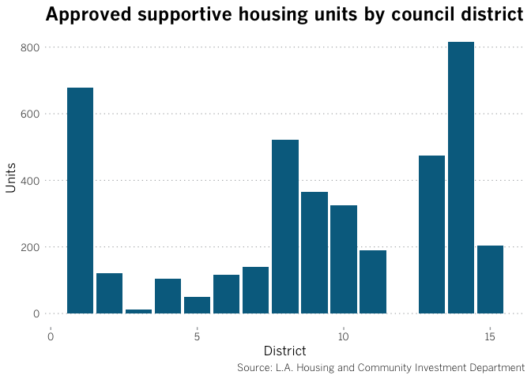
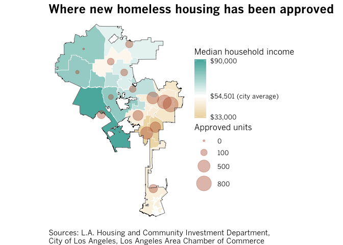
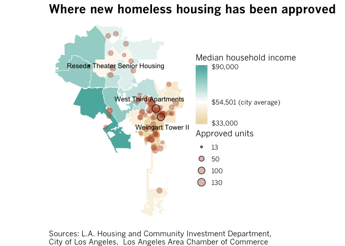
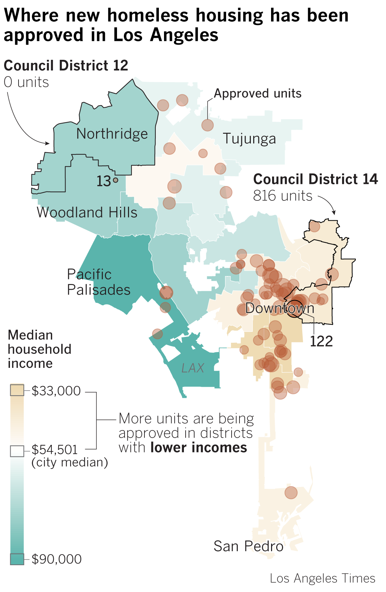

Load libraries and set directory
--------------------------------

This notebook reads in data on approved homeless housing projects by Los Angeles City Council Districts and cleans the files for data visualization: A bar chart of approved units by district and two map variants that plots each project within the city of Los Angeles. The mapping portion geocodes the lon/lat of each address. A Google API key will be required if you wish to geocode the data yourself here or for another script.

But first, a quick shoutout: [Andrew Tran](https://twitter.com/abtran) at the Washington Post gave an excellent NICAR session on mapping in R that provided the template for much of the mapping code. I highly reccomend [checking it out](https://github.com/andrewbtran/NICAR-2019-mapping)

Load data
---------

The data was provided by the L.A. Housing and Community Investment Department.

Clean data
----------

Make a pivot by most approved housing by district
-------------------------------------------------

``` r
shunits_by_district <- master_data %>% 
  group_by(district_no) %>%
  tally(sh_units, sort = TRUE, name = "sh_units")
shunits_by_district
```

    ## # A tibble: 14 x 2
    ##    district_no sh_units
    ##          <dbl>    <dbl>
    ##  1          14      816
    ##  2           1      679
    ##  3           8      522
    ##  4          13      475
    ##  5           9      366
    ##  6          10      325
    ##  7          15      204
    ##  8          11      190
    ##  9           7      140
    ## 10           2      121
    ## 11           6      116
    ## 12           4      104
    ## 13           5       49
    ## 14           3       13

Make a chart
------------

We want to visualize the uneven distribution of homeless housing units across each city district, so let's make a bar chart.

**NOTE:** The scripts below call in custom the Los Angeles Times 'Benton Gothic' font. If you want to use your own custom fonts, you can import them using the code below or you can skip lines 76-81 and remove the Benton Gothic text calls throughout to use the base font.

``` r
# Install if errored
#install.packages('extrafont')
#install.packages('ggplot2')
#install.packages('forcats')

# Call library
library(ggplot2)
library(extrafont)
```

    ## Registering fonts with R

``` r
library(forcats)

#IMPORTANT: extrafont only works with TTF fonts. If you don't have TTF versions of Benton make sure to have them installed on your computer before running the import function.
#font_import() # This needs to be run just once and can take a bit of time. Comment out after
#loadfonts() # run just once. comment out after

#Benton Gothic should now be available double check by running calling up the list of available fonts
#fonts()

#plot
barchart_shunits_by_district <- ggplot(data = shunits_by_district) + 
    geom_col(mapping = aes(x = district_no, y = sh_units), fill = "#006d8f") +
  # Chart label text
  labs(title = "Approved supportive housing units by council district",
       x = "District",
       y = "Units",
       caption = "Source: L.A. Housing and Community Investment Department") +
  # Chart style
  theme(
    text=element_text(size=12,family="BentonGothic-Regular"),
    #title
    plot.title = element_text(
      size = 18,
      family = "BentonGothic-Bold",
     # hjust = 0.5,
      lineheight = 1.2
    ),
    # remove default grid
    panel.grid.major = element_blank(),
    panel.grid.minor = element_blank(),
    panel.background = element_blank(),
    # caption
    plot.caption = element_text(
      family = "BentonGothic-Light"
      ),
    # x-axis ticks
    axis.ticks.x = element_line(
      color = "#a7a9ac"
    ),
    # y-axis ticks
    axis.ticks.y = element_blank(),
    panel.grid.major.y =  element_line(
      color = "#a7a9ac",
      linetype = 3,
      lineend = "butt"
    )
  )
barchart_shunits_by_district
```



Geocoding and projecting
------------------------

Before we can map, we must geocode the data. We'll do this using the ggmap package. Using a [script via storybench](http://www.storybench.org/geocode-csv-addresses-r/).

**You will need a Google API key to geocode**. <https://cloud.google.com/docs/authentication/api-keys#securing_an_api_key>

Remove `Eval = FALSE` and put in your key in \[API\_KEY\_HERE\] if you want to run the geocoding script. You can also skip this chunk if you want to run the rest of the script.

``` r
# Uncomment and install if you've never done so
#install.packages("ggmap")
library(ggmap)

# Let's kick out the cleaned master_data file as CSV so ggmap can geocode
write_csv(master_data, here("/revised_data/master_data_to_geocode.csv"))

# Read in the CSV data and store it in a variable 
origAddress <- read.csv(here("/revised_data/master_data_to_geocode.csv"), stringsAsFactors = FALSE)

# Initialize the data frame
geocoded <- data.frame(stringsAsFactors = FALSE)

# Set up API key
# this sets your google map permanently
register_google(key = "[API_KEY_HERE]", write = TRUE)

# Loop through the addresses to get the latitude and longitude of each address and add it to the
# origAddress data frame in new columns lat and lon
for(i in 1:nrow(origAddress))
{
  # Print("Working...")
  result <- geocode(origAddress$address[i], output = "latlona", source = "google")
  origAddress$lon[i] <- as.numeric(result[1])
  origAddress$lat[i] <- as.numeric(result[2])
  origAddress$geoAddress[i] <- as.character(result[3])
}

#
# Write a CSV file containing origAddress to the working directory
write_csv(origAddress, here("/revised_data/master_data_geocoded.csv"))
```

Get the shapefiles
------------------

``` r
# Uncomment and install if haven't before
#install.packages("stringr")
#install.packages("sf")
library(sf)
library(stringr)

# Call in geocoded data
master_data_geocoded <- read_csv(here("/revised_data/master_data_geocoded.csv"))

# A nifty code chunk that you can use to download shapefiles directly
# Grab council district shapefiles directly from city of LA
file_url <- "https://data.lacity.org/api/geospatial/5v3h-vptv?method=export&format=Shapefile"
# Where to put it
file_dir <- "original_data/shapefiles/council_districts"

# If the shapefile exists, download it, unzip it and create a temporary object for it
if (!file.exists(file_dir)) {
  
  temp <- tempfile()
  download.file(
    file_url,
    temp)
  unzip(temp, exdir=file_dir, overwrite=T)
  unlink(temp)
}

# Find the shapefile file within the unzipped files and give it a name.
shape_file <- paste0(file_dir,"/",list.files(file_dir)) %>% str_subset(".shp")
shp_council_district <- st_read(shape_file)

# Do it again for a city boundary only. I originally thought I'd need this but did not use in the end but keeping the code here (I'm sure there's a more sophisticated way to loop through a list of file_urls and download them in one go).
file_url <- "https://data.lacity.org/api/geospatial/ppge-zfr4?method=export&format=Shapefile"
file_dir <- "original_data/shapefiles/la_city_boundary"

if (!file.exists(file_dir)) {
  
  temp <- tempfile()
  download.file(
    file_url,
    temp)
  unzip(temp, exdir=file_dir, overwrite=T)
  unlink(temp)
}
shape_file <- paste0(file_dir, "/",list.files(file_dir)) %>% str_subset(".shp")
city_boundary <- st_read(shape_file)

# We need to project all the GIS data to WGS84 pseudo mercator which is what we use for most maps at LAT.
shp_council_district <- st_transform(shp_council_district, 3857)
city_boundary <- st_transform(city_boundary, 3857)

# Changing the projection of dataframe with the xy coords so it matches to the reprojected shapefile
master_data_geocoded_projected <- master_data_geocoded %>% 
  filter(!is.na(lon)) %>% 
  st_as_sf(coords=c("lon", "lat"), crs = "+proj=longlat") %>% 
  st_transform(crs=st_crs(shp_council_district)) %>% 
  st_coordinates(geometry)

# Combining old with new
master_data_geocoded  <- cbind(master_data_geocoded , master_data_geocoded_projected)
colnames(master_data_geocoded)[colnames(master_data_geocoded)=="X"] <- "lon_projected"
colnames(master_data_geocoded)[colnames(master_data_geocoded)=="Y"] <- "lat_projected"

#Call in median income data
median_income <- read_csv(here("original_data/ACS2016_median_income.csv"))

# Join
master_joined_temp <-left_join(master_data_geocoded, median_income, by=c("district_no"))

# Join right so district 12 which had no project data is still included in the basemap
master_joined_temp <-right_join(master_data_geocoded, median_income, by=c("district_no"))

# Join joined housing data to district shapefile data
master_joined <-left_join(master_joined_temp, shp_council_district, by=c("district_no"="district"))
```

Mapping the data
----------------

Map version 1: Let's combine the chart into the map by doing total SH units per District. To do this, we must get the centroid x/y for each district and assign that back into our dataframe

``` r
# Join
shunits_district_shp_join <-left_join(shp_council_district, shunits_by_district, by=c("district"="district_no"))
shunits_district_shp_mi_join <-left_join(shunits_district_shp_join, median_income, by=c("district"="district_no"))

# Fine the centroid, add it back to dataframe
centroid_xy_temp <- st_centroid(shunits_district_shp_mi_join$geometry)
centroid_xy <- st_coordinates(centroid_xy_temp)
colnames(centroid_xy)[colnames(centroid_xy)=="X"] <- "x_centroid"
colnames(centroid_xy)[colnames(centroid_xy)=="Y"] <- "y_centroid"
final_join  <- cbind(shunits_district_shp_mi_join , centroid_xy) 
final_join[12, 5] = 0

# Map!
map <- ggplot(final_join) +
  # Draw the council districts and color code them by median income
  geom_sf(
    aes(fill=median_hh_income),
    # Stroke color
    color="white",
    size = .2) +
  # Draw the circles and size them by the sh_units column
  geom_point(
    aes(x = x_centroid, y = y_centroid, size = sh_units),
      shape = 21,
      stroke = .5,
      fill = "#b75a36",
      color = "#b75a36",
      alpha = .4) +
  # Draw a boundary line of the city of Los Angeles and style it
  geom_sf(data = city_boundary, size = .2, color = "black", fill = NA) +
  # Set the circle areas
  scale_size(
    name = "Approved units",
    breaks = c(0, 100, 500, 800),
    range = c(1,10)) +
  # Customize the gradient ramp. $54501 is the city median income
  scale_fill_gradient2(
    name = "Median household income",
    breaks=c(min(final_join$median_hh_income),54501,max(final_join$median_hh_income)),
    labels=c("$33,000","$54,501 (city average)","$90,000"),
    low = "#dfc27d",
    mid = "white",
    high = "#5ab4ac",
    midpoint = 54501,
    space = "Lab",
    na.value = "black",
    guide = "colourbar",
    aesthetics = "fill") +
  coord_sf() +
  # Take away a bunch of ugly base styles
  theme_void() +
  # Header + caption
  theme(panel.grid.major = element_line(colour = 'transparent'),
    text=element_text(size=12,family="BentonGothic-Regular"),
    #title
    plot.title = element_text(
      size = 18,
      family = "BentonGothic-Bold",
     # hjust = 0.5,
      lineheight = 1.2),
    plot.caption = element_text(size=11, hjust = 0)
    ) +
    labs(title="Where new homeless housing has been approved",
       caption="Sources: L.A. Housing and Community Investment Department, \nCity of Los Angeles, Los Angeles Area Chamber of Commerce") 
map
```



``` r
# Export
#install.packages('Cairo')
#install.packages('svglite')
#install.packages("gdtools")
library(svglite)
library(gdtools)
#ggsave(file = here("map_export.svg"), plot = map2, scale = 1, width = 5, height = 7, units = c("in"))
```

Mapping the data 2
------------------

Where as the first map visualizes the total housing units for each district, the code below draws the same map, but draws each approved project by its address and the number of units. Since we're using the barchart that already shows the tally, the reporter asked to see a version where we map each project instead to show truer geographic spread.

``` r
#install.packages("ggrepel")
#install.packages("shadowtext")
library("ggrepel")
library("shadowtext")

# Create a subset to label highs and lows to add custom labels
master_joined_filtered <- master_joined %>% filter(master_joined$sh_units >= 120 | master_joined$sh_units <= 15)

# Clean up project names for labeling
master_joined_filtered [2, 1] = "Reseda Theater Senior Housing" 
master_joined_filtered [3, 1] = "Weingart Tower II" 

# Map!
map2 <- ggplot(final_join) +
  # Map districts and color by median income
  geom_sf(
    aes(fill=median_hh_income),
    color="white",
    size = .2) +
  # Customize the gradient ramp. $54501 is the city median income
  scale_fill_gradient2(
    name = "Median household income",
    breaks=c(min(master_joined$median_hh_income),54501,max(master_joined$median_hh_income)),
    labels=c("$33,000","$54,501 (city average)","$90,000"),
    low = "#dfc27d",
    mid = "white",
    high = "#5ab4ac",
    midpoint = 54501,
    space = "Lab",
    na.value = "black",
    guide = "colourbar",
    aesthetics = "fill") +
  # Map approved projects scaled to the number of SH units
  geom_point(
    data = master_joined,
    aes(x = lon_projected, y = lat_projected, size = sh_units),
      shape = 21,
      stroke = .5,
      fill = "#b75a36",
      color = "#b75a36",
      alpha = .4) +
  # Map the subset with different styles to make them visible
  geom_point(
    data = master_joined_filtered,
    aes(x = lon_projected, y = lat_projected, size = sh_units),
    shape = 21,
    stroke = .5,
    fill = NA,
    color = "black") +
  # Customize geom_point legend
  scale_size(
    name = "Approved units",
    breaks = c(13, 50, 100, 130),
    range = c(1,5)) +
  # Text labels
  geom_text_repel(
    data = master_joined_filtered,
    aes(x=lon_projected,y=lat_projected, label=project_name), 
      color="black",
      point.padding = .5,
      vjust=.5,
      size=3.5) +
  coord_sf() +
  theme_void() +
  # Header + caption
  theme(
    text=element_text(size=12,family="BentonGothic-Regular"),
    #title
    plot.title = element_text(
      size = 18,
      family = "BentonGothic-Bold",
     # hjust = 0.5,
      lineheight = 1.2
    ),
    panel.grid.major = element_line(colour = 'transparent'),
    plot.caption = element_text(size=11, hjust = 0)) +
    labs(title="Where new homeless housing has been approved",
       caption="Sources: L.A. Housing and Community Investment Department, \nCity of Los Angeles,  Los Angeles Area Chamber of Commerce") 
map2
```



``` r
# Export
#ggsave(file = here("map_export_alt.svg"), plot = map2, scale = 1, width = 5, height = 7, units = c("in"))
```

From this point I did the last 10% of the work in Illustrator after a few edits between the reporter and editor.
----------------------------------------------------------------------------------------------------------------


